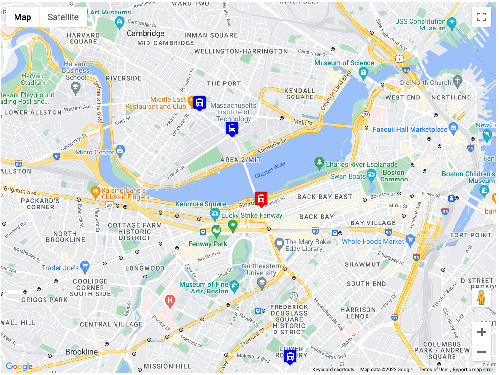

# MapAnimation

## Description 
This is an exercise where a webpage shows a map of Boston and the location of buses between Harvard and MIT in real time. It uses a map from Google maps and bus real time data from mbta.com

## How to Run
Open the html file in any browser

## Roadmap of Future Improvements
Future improvements include:
  - More Bus routes
  - Zoom in to the map

## License Information
No license was used in this project
